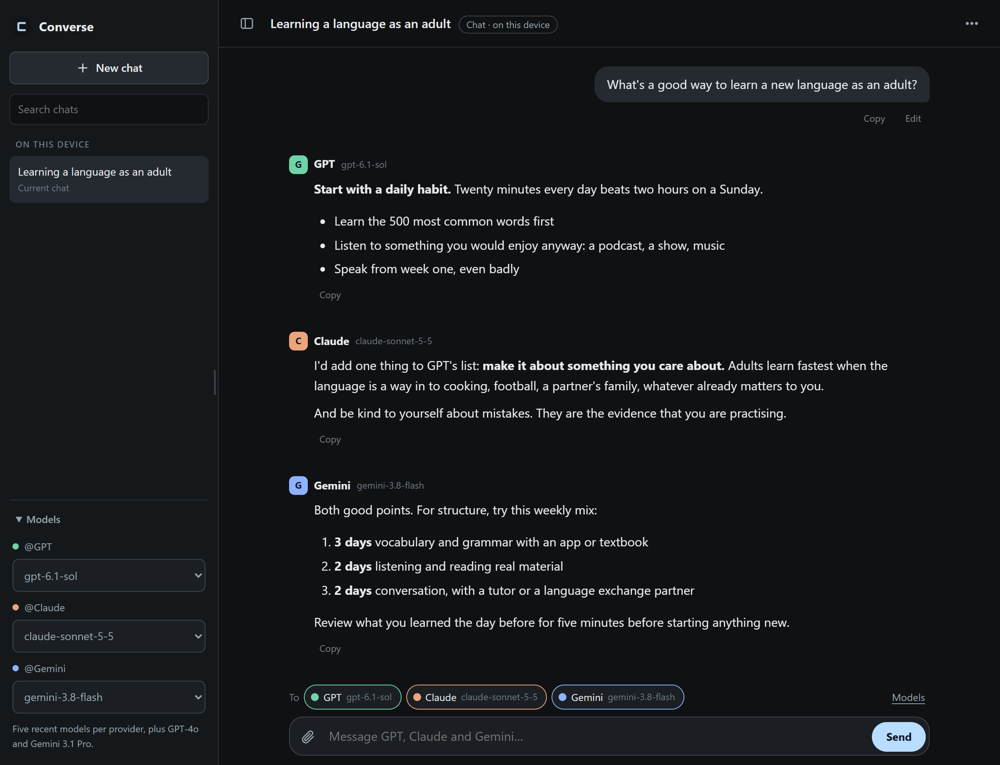
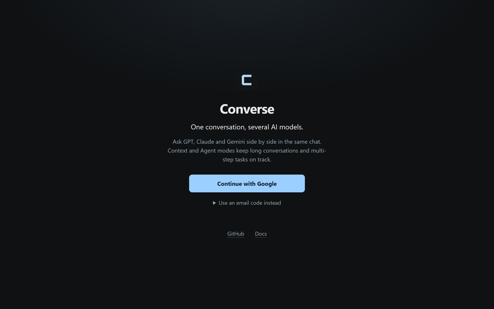

# Converse

**One conversation, several AI models.**

Converse is a chat app where GPT, Claude and Gemini can all take part in the same conversation. Ask one of them, ask all three at once, or have one check another's answer. It runs in the browser, installs like an app on a phone or computer, and uses your own API keys.

**[Try it at converse-cyan.vercel.app](https://converse-cyan.vercel.app)** · [Docs](public/app-guide.md) · [Host your own](docs/HOSTED_CONTEXT.md) · [Project status](PROJECT_CONTEXT.md)



*The replies in this picture are sample text written for the screenshot.*

## Try it

Open [converse-cyan.vercel.app](https://converse-cyan.vercel.app) and sign in with a Google account, or with a code sent to your email if Google sign-in gives you trouble. The first time, it asks for an API key from OpenAI, Anthropic or Google: add at least one under **API keys** and start chatting. Your conversations are billed to your own key.



## What you can do

- **Compare models side by side.** Send one message to several models. Each reply is labelled with the model that wrote it, and the models can see and respond to each other's answers.
- **Keep long conversations on track.** Long chats usually get worse as they grow, because the model has to reread everything each time. Context mode saves the full history and gives the model a tidier working copy, with the original always there to look up. You can switch between GPT and Claude partway through.
- **Hand over a multi-step task.** In Agent mode you describe a goal and the model works through it in steps: reading your files, searching the web, doing calculations, writing documents. It stops when it is done or reaches the limits you set, and you can stop or resume it yourself.
- **Work with files and images.** Upload text or Markdown documents, and in Context and Agent modes JPEG or PNG images too. Models can read and edit the documents, and every version is kept.
- **Search the web.** In Context and Agent modes, GPT and Claude can look things up and read pages, and the sources are saved with the conversation.
- **Have it remember what you decided.** Converse notes commitments you make in a conversation, such as a budget or a deadline, with a link to where you said it. You can correct an entry or tell it to stop using one.
- **See what the model was sent.** A panel shows what went into each request and how large it was. You can export a readable transcript, or a complete record of everything that happened.
- **Use your own keys.** Your chats are billed to your own OpenAI, Anthropic and Google accounts.
- **Install it.** Add it to your home screen or desktop from the browser. Saved chats open offline; replies need a connection.

## The three modes

| Mode | What it is for | Models |
|---|---|---|
| **Chat** | Quick questions and comparing answers. Several models can reply at once. | GPT, Claude, Gemini |
| **Context** | Long conversations with saved history, files, memory and web search. | GPT, Claude |
| **Agent** | A goal the model works towards step by step, using the same tools. | GPT, Claude |

The in-app **Docs** page explains each of these in detail. It is the same [guide](public/app-guide.md) the models themselves can read.

## Your data

- **API keys** stay on the server and are never sent back to the browser. On a hosted copy with personal keys turned on, each key is checked with its provider, stored encrypted, and shown afterwards only by its last four characters.
- **Chat mode** conversations are stored in your browser, separately for each signed-in account.
- **Context and Agent** conversations are stored on the server. With Google sign-in they belong to the account that created them, and other accounts cannot open them.
- **Your messages** go to the model providers you choose, under your own keys.
- **Removing a document** stops models from using it, but the original stays in the conversation's history and in exports. It is not permanent erasure.

## Run it yourself

You need [Node.js](https://nodejs.org) 22.13 or newer and an API key from at least one of OpenAI, Anthropic or Google.

```bash
git clone https://github.com/DanPace725/converse.git
cd converse
npm ci
cp .env.example .env
npm run dev
```

Put your keys in `.env`, then open http://localhost:3211. On Windows PowerShell, use `Copy-Item .env.example .env` for the copy step.

| Setting | What it does |
|---|---|
| `OPENAI_API_KEY` | Turns on GPT, web search with GPT, and meaning-based history search. |
| `ANTHROPIC_API_KEY` | Turns on Claude and web search with Claude. |
| `GEMINI_API_KEY` | Turns on Gemini in Chat mode. |
| `JEV_API_KEY` | Optional. Turns on Jev, a helper that advises on what to keep in a long conversation's working copy. Without it, a small model from the same provider does that job on the same key: Luna for GPT conversations, Haiku for Claude ones. |
| `CONCLAVE_DATA_DIR` | Where Context and Agent conversations are saved on your machine. Without it they go to a `CLA/conclave/.conclave` folder beside the checkout. |

Run locally, there is no sign-in and Context and Agent conversations are saved in a SQLite file on your machine.

## Host it for other people

Converse deploys to [Vercel](https://vercel.com) with a [Neon](https://neon.com) Postgres database, and no build step. A hosted copy can offer:

- **Google sign-in**, limited to addresses you list or open to any Google account.
- **Email-code sign-in** as a fallback, for anyone Google sign-in does not work for. It needs email sign-in enabled in Neon and an email provider configured.
- **Personal API keys**, so each person brings their own and nobody spends yours.

The [hosted setup guide](docs/HOSTED_CONTEXT.md) walks through both. There are no per-person usage limits yet, so everyone you admit uses your database and hosting.

## What it does not do

- Context and Agent modes work with GPT and Claude only; Gemini is available in Chat.
- An Agent run needs the tab left open. Nothing runs unattended in the background.
- Page reading handles ordinary web pages. It does not run JavaScript, read PDFs or get past logins and paywalls.
- Models cannot run code or touch files on your computer. The files they work with live inside the conversation.

## For developers

```bash
npm test                    # unit tests
npm run check               # syntax and engine parity
npm run test:browser        # browser tests (Playwright, using installed Microsoft Edge)
npm run test:agent:browser  # the Agent browser tests alone
```

The part that manages context, runs agents and talks to the models is a separate engine called [Conclave](https://github.com/DanPace725/conclave). It is developed in its own repository and copied into `lib/conclave/`; `npm run check` fails if the copy has drifted. Change the engine there, not here. [AGENTS.md](AGENTS.md) and the [development method](docs/DEVELOPMENT_METHOD.md) describe the workflow.

| Area | Location |
|---|---|
| Browser app and the Docs guide | `public/` |
| HTTP handlers | `api/`, `lib/conclave-http.js` |
| Chat-mode model adapters | `lib/providers.js` |
| Conclave engine copy | `lib/conclave/`, [snapshot notes](lib/conclave/VENDORED.md) |
| Storage and database schema | `lib/context-repository.js`, `lib/database.js`, `drizzle/` |
| Sign-in and personal API keys | `api/session.js`, `lib/neon-auth.js`, `lib/conclave/credentials.js`, `api/keys.js` |
| Reports and comparisons | `scripts/`, [commands](docs/REPORTING.md) |

## Status

Converse is a personal project in active development. [PROJECT_CONTEXT.md](PROJECT_CONTEXT.md) records what works, what has been checked and how, and what has not been tried yet.

## Licence

[MIT](LICENSE).
